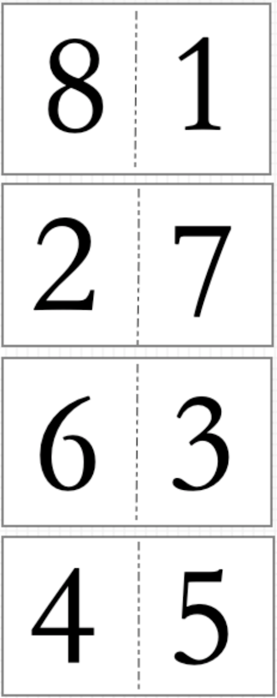

# pdf-typeset
提供对PDF文件页面的排版处理

```
npm install pdf-typeset --save
```

## API

### toTimes()
@param {path} options.sourcePath `原PDF路径`  
@param {path} options.outputPath `输出路径`  
@param {path} options.fillPagePath `填补页面倍数的pdf（取第一页）`  
@param {number} options.insertIndex `插入空白页的原PDF索引`  
@param {number} options.times `PDF处理页面倍数`  
@param {function} cb `处理完成后的回调`  

用空白页或指定PDF的第一页 插入指定页数位置，将PDF处理成多少倍数的页数  
```
const { toTimes } = require('pdf-typeset')

toTimes({
  sourcePath: 'source.pdf', 
  fillPagePath: 'fill.pdf',
  insertIndex: -2,
  times: 5,
}, (data, errMsg) => {
  if (data) fs.writeFileSync(`source-after.pdf`, data)
})
```

### toBook()
@param {path} options.sourcePath `原PDF路径`  
@param {path} options.outputPath `输出路径`  
@param {path} options.fillPagePath `填补页面倍数的pdf（取第一页）`  
@param {number} options.insertIndex `插入空白页的原PDF索引`  
@param {function} cb `处理完成后的回调`  

将A4 PDF处理成 书册子A3排版（同时处理4倍页数）
```
const { toBook } = require('pdf-typeset')

toBook({
  sourcePath: 'source.pdf', 
  insertIndex: -2,
  fillPagePath: 'fill.pdf',
}, (data) => {
  data && fs.writeFileSync(`source-after.pdf`, data)
})
```

#### 书册子A3排版效果
